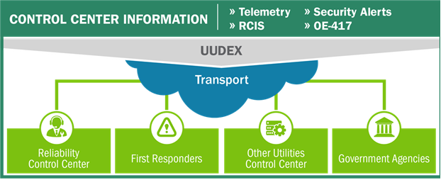

# UUDEX: Universal Utility Data Exchange

The standard used for sharing power system measurement data between utility control centers in the electric power sector is the Inter-control Center Communications Protocol (ICCP). ICCP is over 20 years old and uses protocols and technology that were state-of-the-art in 1995 when ICCP was initially developed. As a result, ICCP is an inflexible, difficult-to-configure toolset that includes security as a rarely enabled add-on. 

This project replaces the information sharing component of ICCP, taking advantage of current methods of security, data transport, information modeling, and configuration, that uses secure-by-default transport and authentication methodologies. This new information exchange paradigm provides a flexible, dynamic, and scalable platform that provides the following benefits.
- Allows energy delivery systems (EDS) operators to more easily exchange measurement and operational data.
- Replace the Reliability Coordinator Information System (RCIS) that is used to post and share operating information between control centers in near real time.
- Provide a mechanism to exchange disturbance reports.
- Share structured threat information, including firewall rule updates and vulnerability and patch notifications.
- Support other information exchanges commonly found between control centers. 

The information modeling flexibility enables the system to rapidly adapt and respond to changing information exchange needs and can be easily extended to other energy sub-sectors or uses. The open and flexible information transport protocols enable the rapid reconfiguration or addition of new information exchange partners.

UUDEX is implemented using a secure client-server architecture that enables a publish-subscribe with persistence message bus to support both near real time information exchange for measurement and operational data, as well as an asynchronous exchange for less time-sensitive information such as power system model updates.  UUDEX consists of two primary components:  A client and an API server.

[Client README](client/README.md)

[API Server README](server/README.md)
